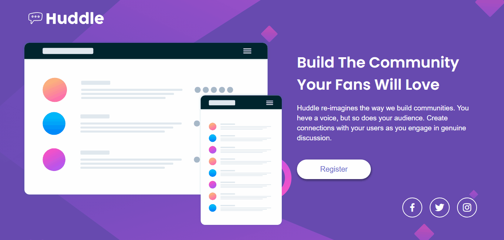
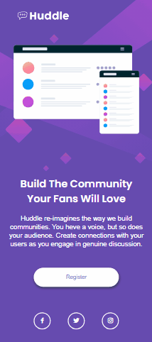

# Frontend Mentor - Solução da página de destino Huddle com uma única seção introdutória

Esta é uma solução para o desafio da [página de destino Huddle com uma única seção introdutória no Frontend Mentor](https://www.frontendmentor.io/challenges/huddle-landing-page-with-a-single-introductory-section-B_2Wvxgi0).Os desafios do Frontend Mentor ajudam a melhorar suas habilidades de codificação ao construir projetos realistas.

## Sumário

- [Visão Geral](#visão-geral)
    - [O desafio](#o-desafio)
    - [Captura de telas](#captura-de-tela)
    - [Links](#links)
- [Meu processo](#meu-processo)
    - [Construido com](#construido-com)
    - [Recursos úteis](#recursos-úteis)
    - [Autor](#autor)

## Visão Geral

### O desafio
Os usuários devem ser capazes de:
- Visualizar o layout ideal da página dependendo do tamanho da tela do dispositivo.
- Ver todos os elementos interativos na página

## Captura de tela

### Versão mobile:

    

## Links
- URL da Solução: [https://github.com/Luiz-Antoni0/quest-html-css-avancado-huddle-landing-page.git](https://github.com/Luiz-Antoni0/quest-html-css-avancado-huddle-landing-page.git)
- URL do Site Ativo: <a href="https://luiz-antoni0.github.io/quest-html-css-avancado-huddle-landing-page/" target="_blank">https://luiz-antoni0.github.io/quest-html-css-avancado-huddle-landing-page/</a>

## Meu processo

### Construido com:

- Marcação HTML5
- Propriedades pessonalizadas com CSS
- Flexbox

### Recursos úteis

- [PerfectPixel](https://chromewebstore.google.com/detail/perfectpixel-by-welldonec/dkaagdgjmgdmbnecmcefdhjekcoceebi?pli=1) - Com ele foi capaz de ter uma noção do tamanho e espaço dos elementos, já que o FrontEnd Mentor ele não disponibiliza o layout do figma gratuitamente, o único modelo que é disponibilizado são por imagens.

- [Google Fonts](https://fonts.google.com/) - Através dele encontrei as fontes que o projeto pedia, com o peso de cada uma delas e as suas famílias.

- [Boxicons](https://boxicons.com/) - Foi com ele que conseguir encontrar os icones das redes socias, que se pedia no projeto.

### Autor

- GitHub - [Luiz-Antoni0](https://github.com/Luiz-Antoni0)
- Frontend Mentor - [@Luiz-Antoni0](https://www.frontendmentor.io/profile/Luiz-Antoni0)